# 🔄 Universal API Key Rotation System

> **A Master Class & Reference Implementation**
>
> *Target Audience: System Architects, Senior Engineers, and AI Agents.*
> *Goal: To establish a fail-proof, maximizing-throughput strategy for consuming rate-limited Third-Party APIs.*

---

## 📑 Table of Contents
1. [System Architecture](#system-architecture)
2. [Visual Workflows (Mermaid Diagrams)](#visual-workflows)
3. [Core Concepts & Theory](#core-concepts--theory)
4. [Gemini API Error Reference](#gemini-api-error-reference) ⚡ **NEW**
5. [Reference Implementation (TypeScript)](#reference-implementation)
6. [Integration Guide](#integration-guide)
7. [Instructions for AI Agents](#instructions-for-ai-agents)

---

## 🏗️ System Architecture

The **API Rotation System** is a middleware layer that sits between your application logic and external API providers (like OpenAI, Google Gemini, Anthropic). It transforms a single point of failure (one key) into a resilient, self-healing pool of resources.

### The Problem
- **Rate Limits (429):** APIs impose strict RPM (Requests Per Minute) limits.
- **Quotas:** Daily or monthly limits that disable a key for long periods.
- **Failures:** Transient server errors (500, 503) that require backoff.
- **Safety Blocks:** Content filtered by AI safety policies (Gemini-specific).
- **Context Overflows:** Exceeding token limits mid-operation.

### The Solution: "The Hydra Pattern"
Instead of relying on one head (key), we maintain multiple. If one is cut off (rate limited), another immediately takes its place.

```
[ Application ]
       │
       ▼
[ Rotation Manager ] ──┬── [ Key Pool ]
       │               ├── Key A (Healthy)
       │               ├── Key B (Healthy)
       │               └── Key C (Cooling Down)
       ▼
 [ Error Handler ] ◀─── ( 429 / 5xx / finishReason )
       │
       ├── Updates Key State (Circuit Open)
       └── Parses Response Metadata
```

---

## 🎨 Visual Workflows

### 1. Key Selection State Machine
How the system decides which key to pick next. Priorities: **Health > Fail Count > Recency**.

```mermaid
graph TD
    Start([Request Key]) --> Filter[Filter: Exclude OPEN Circuit & Cooling Down]
    Filter --> IsEmpty{Any Keys Left?}

    IsEmpty -- No --> Fallback[Return Oldest Failed Key\n"Last Resort"]
    IsEmpty -- Yes --> CheckDead{Any Permanently Dead Keys?}

    CheckDead -- Yes --> SkipDead[Skip 403/Invalid Keys]
    CheckDead -- No --> Priority1{Has Pristine Keys?\n"Never Failed"}

    SkipDead --> Priority1
    Priority1 -- Yes --> SelectPristine[Select Pristine Key]
    Priority1 -- No --> Priority2[Sort by Fewest Failures]

    SelectPristine --> UpdateLRU[Update Last Used Timestamp]
    Priority2 --> UpdateLRU

    UpdateLRU --> Return([Return Selected Key])

    style Start fill:#f9f,stroke:#333,stroke-width:2px
    style Return fill:#9f9,stroke:#333,stroke-width:2px
    style Fallback fill:#ff9,stroke:#333,stroke-width:2px
    style SkipDead fill:#f66,stroke:#333,stroke-width:2px
```

### 2. The Circuit Breaker Lifecycle
How a single key transitions between states based on API responses.


### 3. Gemini Error Classification Flow

```mermaid
flowchart TD
    Response[API Response] --> CheckHTTP{HTTP Status?}

    CheckHTTP -->|200 OK| ParseBody[Parse Response Body]
    CheckHTTP -->|400| BadRequest[INVALID_ARGUMENT\nDo NOT Retry]
    CheckHTTP -->|403| PermDenied[PERMISSION_DENIED\nMark Key DEAD]
    CheckHTTP -->|404| NotFound[NOT_FOUND\nDo NOT Retry]
    CheckHTTP -->|429| RateLimit[RESOURCE_EXHAUSTED]
    CheckHTTP -->|499| Cancelled[Client Cancelled\nNo Action]
    CheckHTTP -->|500| Internal[INTERNAL\nRetry with Backoff]
    CheckHTTP -->|503| Unavailable[UNAVAILABLE\nRetry with Backoff]
    CheckHTTP -->|504| Deadline[DEADLINE_EXCEEDED\nRetry with Backoff]

    ParseBody --> CheckFinish{finishReason?}

    CheckFinish -->|STOP| Success[✅ Success\nmarkSuccess]
    CheckFinish -->|SAFETY| SafetyBlock[⚠️ Content Blocked\nDo NOT count as key failure]
    CheckFinish -->|MAX_TOKENS| Truncated[⚠️ Truncated\nMay need continuation]
    CheckFinish -->|RECITATION| Recitation[⚠️ Copyright Match\nRephrase prompt]
    CheckFinish -->|OTHER| Other[⚠️ Unknown\nLog & Investigate]

    RateLimit --> CheckRetryAfter{Has Retry-After Header?}
    CheckRetryAfter -->|Yes| UseHeader[Use Header Value]
    CheckRetryAfter -->|No| UseDefault[Use Default 5min Cooldown]

    UseHeader --> MarkQuota[markFailed with isQuota=true]
    UseDefault --> MarkQuota

    style Success fill:#9f9
    style PermDenied fill:#f66
    style SafetyBlock fill:#ff9
    style RateLimit fill:#f96
```



### 4. Request Flow Sequence


---

## 🧠 Core Concepts & Theory

### 1. Circuit Breaker Pattern
Prevent "hammering" a dead key.
- **CLOSED:** Normal operation. Requests flow through.
- **OPEN:** Key is effectively blind-folded. No requests are allowed for a `COOLDOWN` period.
- **HALF_OPEN:** After cooldown, allow **one** "canary" request. If it succeeds, Close circuit. If it fails, Re-Open immediately.
- **DEAD:** ⚡ *New state* - Key is permanently invalid (403 errors). Never use again.

### 2. Quota-Aware Backoff Strategies
Not all errors are equal.
| Error Type | HTTP Code | Action | Cooldown |
|------------|-----------|--------|----------|
| Rate Limit | 429 | Open Circuit | Per `Retry-After` or 5 min |
| Transient | 500, 503, 504 | Short Backoff | 1 min |
| Auth Error | 403 | **Permanent Ban** | ∞ (Remove from pool) |
| Bad Request | 400 | **Do NOT Retry** | N/A |
| Not Found | 404 | **Do NOT Retry** | N/A |
| Client Cancel | 499 | No action | N/A |

### 3. Load Balancing Strategy
- **Least Recently Used (LRU):** Prevents hot-spotting one key.
- **Pristine First:** Always prefer keys that have *never* failed recently over those that have "recovered".
- **Dead Key Avoidance:** Skip keys marked as `DEAD` entirely.

### 4. Exponential Backoff with Jitter
When all keys are busy/failing, the app must wait.
```
Delay = min(MaxDelay, Base * 2^Attempts) + Random(0, 1000ms)
```
*Jitter prevents "Thundering Herd" where all clients retry at the exact same millisecond.*

**Google's Recommended Formula:**
```typescript
const delay = Math.min(maxBackoff, baseDelay * Math.pow(2, attempt)) + Math.random() * 1000;
```

### 5. Retry-After Header ⚡ NEW
When receiving a 429, **always check for the `Retry-After` header**:
- It may be a number (seconds) or a date string
- **This value takes precedence** over your calculated backoff
- Parse both formats: `Retry-After: 120` or `Retry-After: Wed, 21 Oct 2025 07:28:00 GMT`

---

## 🔥 Gemini API Error Reference

This section provides a **complete reference** of all error codes, response states, and edge cases specific to Google's Gemini API.

### HTTP Status Codes

| Code | Name | Description | Retry Strategy |
|------|------|-------------|----------------|
| **200** | OK | Success | N/A |
| **400** | `INVALID_ARGUMENT` | Malformed request, missing fields, or API version mismatch. Also occurs when free tier is unavailable in your region. | ❌ **Do NOT retry** - Fix request |
| **400** | `FAILED_PRECONDITION` | Request cannot proceed in current state | ❌ **Do NOT retry** - Check prerequisites |
| **403** | `PERMISSION_DENIED` | Invalid API key, wrong permissions, or unauthenticated tuned model access | ❌ **Mark key as DEAD** |
| **404** | `NOT_FOUND` | Referenced resource (file, image, model) not found | ❌ **Do NOT retry** - Fix reference |
| **429** | `RESOURCE_EXHAUSTED` | Rate limit or quota exceeded (RPM/TPM/RPD) | ✅ **Rotate key** + respect `Retry-After` |
| **499** | `CANCELLED` | Client cancelled the request | ⚪ No action needed |
| **500** | `INTERNAL` | Unexpected server error, overloaded service, or context too long | ✅ **Retry with backoff** |
| **503** | `UNAVAILABLE` | Service temporarily overloaded or down | ✅ **Retry with backoff** |
| **504** | `DEADLINE_EXCEEDED` | Request took too long (large prompt/context) | ✅ **Retry with smaller input** |

### Response finishReason Values

Even with HTTP 200, the response may indicate issues:

| finishReason | Meaning | Key Impact | Action |
|--------------|---------|------------|--------|
| `STOP` | ✅ Generation completed naturally | None | `markSuccess()` |
| `MAX_TOKENS` | Output truncated at token limit | None | Request continuation or increase `maxOutputTokens` |
| `SAFETY` | ⚠️ Content blocked by safety filters | **None** (not key's fault) | Check `safetyRatings`, adjust prompt |
| `RECITATION` | ⚠️ Output too similar to training data (copyright) | **None** | Rephrase prompt, increase `temperature` |
| `OTHER` | Unknown/misc reason | Investigate | Log for debugging |

> **CRITICAL:** `SAFETY` and `RECITATION` are **NOT key failures**. They indicate content issues, not quota problems. Do not call `markFailed()` for these!

### Safety Categories (for SAFETY blocks)

When `finishReason === 'SAFETY'`, inspect `safetyRatings`:

| Category | Description |
|----------|-------------|
| `HARM_CATEGORY_HARASSMENT` | Harassment content |
| `HARM_CATEGORY_HATE_SPEECH` | Hate speech |
| `HARM_CATEGORY_SEXUALLY_EXPLICIT` | Sexual content |
| `HARM_CATEGORY_DANGEROUS_CONTENT` | Dangerous/harmful content |
| `HARM_CATEGORY_CIVIC_INTEGRITY` | Election/civic misinformation |

### Gemini Rate Limits (2025/2026 Free Tier)

> ⚠️ These limits were significantly reduced in December 2025.

| Model | RPM | RPD | TPM |
|-------|-----|-----|-----|
| Gemini 2.5 Pro | 5 | 100 | 250,000 |
| Gemini 2.5 Flash | 10 | 250 | 250,000 |
| Gemini 2.5 Flash-Lite | 15 | 1,000 | 250,000 |
| Gemini 3 Pro Preview | 10-50* | 100+ | 250,000 |

*\*Dynamically adjusted based on account age and region*

### Streaming-Specific Considerations

| Issue | Symptom | Solution |
|-------|---------|----------|
| Context overflow | "Your input context is too long" | Reduce input or use larger context model |
| Invalid stream chunk | Stream ends unexpectedly | Implement stream recovery + partial response caching |
| Mobile/Safari issues | ReadableStream failures, 502 errors | Use polyfills or non-streaming fallback |
| Token metadata | Not in intermediate chunks | Only available in **final** chunk of stream |
| AI Gateway buffering | Complete buffering instead of streaming | Check proxy/gateway configuration |

### Error Detection Regex Patterns

Use these patterns to classify errors programmatically:

```typescript
const ERROR_PATTERNS = {
    // Quota/Rate Limit Detection
    isQuotaError: /429|quota|exhausted|resource.?exhausted|too.?many.?requests|rate.?limit/i,

    // Permanent Key Death
    isAuthError: /403|permission.?denied|invalid.?api.?key|unauthorized|unauthenticated/i,

    // Safety/Content Blocks (NOT key failures)
    isSafetyBlock: /safety|blocked|recitation|harmful|hate|harassment/i,

    // Transient Errors (Retry OK)
    isTransient: /500|502|503|504|internal|unavailable|deadline|timeout|overloaded/i,

    // Bad Requests (Do NOT Retry)
    isBadRequest: /400|invalid.?argument|failed.?precondition|malformed|not.?found|404/i,

    // Context Issues
    isContextError: /context.?too.?long|token.?limit|exceeded|max.?tokens/i,
};
```

---

## 💻 Reference Implementation

This is a **Universal TypeScript Class** that implements all the above patterns, including Gemini-specific handling. Drop this into `src/services/ApiKeyManager.ts`.

### Storage Interface (Generic)
```typescript
interface IStorage {
    getItem(key: string): string | null;
    setItem(key: string, value: string): void;
}
// Defaults to localStorage in browser, or memory/file in Node
```

### Enhanced Error Types ⚡ NEW
```typescript
/** Classifies the type of API error for appropriate handling */
export type ErrorType =
    | 'QUOTA'       // 429 - Rotate key, respect cooldown
    | 'TRANSIENT'   // 500/503/504 - Retry with backoff
    | 'AUTH'        // 403 - Key is dead, remove from pool
    | 'BAD_REQUEST' // 400 - Do not retry, fix request
    | 'SAFETY'      // finishReason: SAFETY - Not a key issue
    | 'RECITATION'  // finishReason: RECITATION - Not a key issue
    | 'UNKNOWN';    // Catch-all

export interface ErrorClassification {
    type: ErrorType;
    retryable: boolean;
    cooldownMs: number;
    markKeyFailed: boolean;
    markKeyDead: boolean;
}
```

### The Code

```typescript
/**
 * Universal ApiKeyManager v2.0
 * Implements: Rotation, Circuit Breaker, Persistence, Exponential Backoff
 * Gemini-Specific: finishReason handling, Safety blocks, RECITATION detection
 */

export interface KeyState {
    key: string;
    failCount: number;           // Consecutive failures
    failedAt: number | null;     // Timestamp of last failure
    isQuotaError: boolean;       // Was last error a 429?
    circuitState: 'CLOSED' | 'OPEN' | 'HALF_OPEN' | 'DEAD';
    lastUsed: number;
    successCount: number;
    totalRequests: number;
    halfOpenTestTime: number | null;
    customCooldown: number | null; // From Retry-After header
}

const CONFIG = {
    MAX_CONSECUTIVE_FAILURES: 5,
    COOLDOWN_TRANSIENT: 60 * 1000,        // 1 minute
    COOLDOWN_QUOTA: 5 * 60 * 1000,        // 5 minutes (default if no Retry-After)
    COOLDOWN_QUOTA_DAILY: 60 * 60 * 1000, // 1 hour for RPD exhaustion
    HALF_OPEN_TEST_DELAY: 60 * 1000,      // 1 minute after open
    MAX_BACKOFF: 64 * 1000,               // 64 seconds max
    BASE_BACKOFF: 1000,                   // 1 second base
};

// Error classification patterns
const ERROR_PATTERNS = {
    isQuotaError: /429|quota|exhausted|resource.?exhausted|too.?many.?requests|rate.?limit/i,
    isAuthError: /403|permission.?denied|invalid.?api.?key|unauthorized|unauthenticated/i,
    isSafetyBlock: /safety|blocked|recitation|harmful/i,
    isTransient: /500|502|503|504|internal|unavailable|deadline|timeout|overloaded/i,
    isBadRequest: /400|invalid.?argument|failed.?precondition|malformed|not.?found|404/i,
};

export class ApiKeyManager {
    private keys: KeyState[] = [];
    private storageKey = 'api_rotation_state_v2';

    constructor(
        initialKeys: string[],
        private storage: Storage = typeof window !== 'undefined' ? window.localStorage : undefined as any
    ) {
        this.keys = initialKeys.map(k => ({
            key: k,
            failCount: 0,
            failedAt: null,
            isQuotaError: false,
            circuitState: 'CLOSED',
            lastUsed: 0,
            successCount: 0,
            totalRequests: 0,
            halfOpenTestTime: null,
            customCooldown: null,
        }));

        this.loadState();
    }

    /**
     * CLASSIFIES an error to determine handling strategy
     */
    public classifyError(error: any, finishReason?: string): ErrorClassification {
        const status = error?.status || error?.response?.status;
        const message = error?.message || error?.error?.message || String(error);

        // 1. Check finishReason first (for 200 responses with content issues)
        if (finishReason === 'SAFETY') {
            return { type: 'SAFETY', retryable: false, cooldownMs: 0, markKeyFailed: false, markKeyDead: false };
        }
        if (finishReason === 'RECITATION') {
            return { type: 'RECITATION', retryable: false, cooldownMs: 0, markKeyFailed: false, markKeyDead: false };
        }

        // 2. Check HTTP status codes
        if (status === 403 || ERROR_PATTERNS.isAuthError.test(message)) {
            return { type: 'AUTH', retryable: false, cooldownMs: Infinity, markKeyFailed: true, markKeyDead: true };
        }
        if (status === 429 || ERROR_PATTERNS.isQuotaError.test(message)) {
            const retryAfter = this.parseRetryAfter(error);
            return {
                type: 'QUOTA',
                retryable: true,
                cooldownMs: retryAfter || CONFIG.COOLDOWN_QUOTA,
                markKeyFailed: true,
                markKeyDead: false
            };
        }
        if (status === 400 || ERROR_PATTERNS.isBadRequest.test(message)) {
            return { type: 'BAD_REQUEST', retryable: false, cooldownMs: 0, markKeyFailed: false, markKeyDead: false };
        }
        if (ERROR_PATTERNS.isTransient.test(message) || [500, 502, 503, 504].includes(status)) {
            return { type: 'TRANSIENT', retryable: true, cooldownMs: CONFIG.COOLDOWN_TRANSIENT, markKeyFailed: true, markKeyDead: false };
        }

        return { type: 'UNKNOWN', retryable: true, cooldownMs: CONFIG.COOLDOWN_TRANSIENT, markKeyFailed: true, markKeyDead: false };
    }

    /**
     * Parses Retry-After header from error response
     */
    private parseRetryAfter(error: any): number | null {
        const retryAfter = error?.response?.headers?.['retry-after'] ||
                          error?.headers?.['retry-after'] ||
                          error?.retryAfter;

        if (!retryAfter) return null;

        // If it's a number (seconds)
        const seconds = parseInt(retryAfter, 10);
        if (!isNaN(seconds)) return seconds * 1000;

        // If it's a date string
        const date = Date.parse(retryAfter);
        if (!isNaN(date)) return Math.max(0, date - Date.now());

        return null;
    }

    /**
     * HEALTH CHECK
     * Determines if a key is usable based on Circuit Breaker logic
     */
    private isOnCooldown(k: KeyState): boolean {
        // Dead keys are NEVER usable
        if (k.circuitState === 'DEAD') return true;

        const now = Date.now();

        if (k.circuitState === 'OPEN') {
            // Check if ready for HALF_OPEN test
            if (k.halfOpenTestTime && now >= k.halfOpenTestTime) {
                k.circuitState = 'HALF_OPEN';
                return false;
            }
            return true;
        }

        // Additional safeguard for custom cooldowns
        if (k.failedAt && k.customCooldown) {
            if (now - k.failedAt < k.customCooldown) return true;
        }

        // Standard cooldown check
        if (k.failedAt) {
            const cooldown = k.isQuotaError ? CONFIG.COOLDOWN_QUOTA : CONFIG.COOLDOWN_TRANSIENT;
            if (now - k.failedAt < cooldown) return true;
        }

        return false;
    }

    /**
     * CORE ROTATION LOGIC
     * Returns the best available key
     */
    public getKey(): string | null {
        // 1. Filter out dead and cooling down keys
        const candidates = this.keys.filter(k =>
            k.circuitState !== 'DEAD' && !this.isOnCooldown(k)
        );

        if (candidates.length === 0) {
            // FALLBACK: Return oldest failed key (excluding DEAD)
            const nonDead = this.keys.filter(k => k.circuitState !== 'DEAD');
            if (nonDead.length === 0) return null; // All keys are dead!

            return nonDead.sort((a, b) => (a.failedAt || 0) - (b.failedAt || 0))[0]?.key || null;
        }

        // 2. Sort candidates: Pristine > Fewest Failures > Least Recently Used
        candidates.sort((a, b) => {
            if (a.failCount !== b.failCount) return a.failCount - b.failCount;
            return a.lastUsed - b.lastUsed;
        });

        const selected = candidates[0];
        selected.lastUsed = Date.now();
        this.saveState();

        return selected.key;
    }

    /**
     * Get count of healthy (non-DEAD) keys
     */
    public getKeyCount(): number {
        return this.keys.filter(k => k.circuitState !== 'DEAD').length;
    }

    /**
     * FEEDBACK LOOP: Success
     */
    public markSuccess(key: string) {
        const k = this.keys.find(x => x.key === key);
        if (!k) return;

        if (k.circuitState !== 'CLOSED' && k.circuitState !== 'DEAD') {
            console.log(`[Key Recovered] ...${key.slice(-4)}`);
        }

        k.circuitState = 'CLOSED';
        k.failCount = 0;
        k.failedAt = null;
        k.isQuotaError = false;
        k.customCooldown = null;
        k.successCount++;
        k.totalRequests++;

        this.saveState();
    }

    /**
     * FEEDBACK LOOP: Failure
     * Enhanced with error classification
     */
    public markFailed(key: string, classification: ErrorClassification) {
        const k = this.keys.find(x => x.key === key);
        if (!k) return;

        // Don't modify DEAD keys
        if (k.circuitState === 'DEAD') return;

        // If this error shouldn't mark the key as failed, skip
        if (!classification.markKeyFailed) return;

        k.failedAt = Date.now();
        k.failCount++;
        k.totalRequests++;
        k.isQuotaError = classification.type === 'QUOTA';
        k.customCooldown = classification.cooldownMs || null;

        // Permanent death for auth errors
        if (classification.markKeyDead) {
            k.circuitState = 'DEAD';
            console.error(`[Key DEAD] ...${key.slice(-4)} - Permanently removed from rotation`);
            this.saveState();
            return;
        }

        // State Transitions
        if (k.circuitState === 'HALF_OPEN') {
            k.circuitState = 'OPEN';
            k.halfOpenTestTime = Date.now() + CONFIG.HALF_OPEN_TEST_DELAY;
        } else if (k.failCount >= CONFIG.MAX_CONSECUTIVE_FAILURES || classification.type === 'QUOTA') {
            k.circuitState = 'OPEN';
            k.halfOpenTestTime = Date.now() + (classification.cooldownMs || CONFIG.HALF_OPEN_TEST_DELAY);
        }

        this.saveState();
    }

    /**
     * Legacy markFailed for backward compatibility
     */
    public markFailedLegacy(key: string, isQuota: boolean = false) {
        this.markFailed(key, {
            type: isQuota ? 'QUOTA' : 'TRANSIENT',
            retryable: true,
            cooldownMs: isQuota ? CONFIG.COOLDOWN_QUOTA : CONFIG.COOLDOWN_TRANSIENT,
            markKeyFailed: true,
            markKeyDead: false,
        });
    }

    /**
     * Calculate backoff delay with jitter
     */
    public calculateBackoff(attempt: number): number {
        const exponential = CONFIG.BASE_BACKOFF * Math.pow(2, attempt);
        const capped = Math.min(exponential, CONFIG.MAX_BACKOFF);
        const jitter = Math.random() * 1000;
        return capped + jitter;
    }

    /**
     * Get health statistics
     */
    public getStats(): { total: number; healthy: number; cooling: number; dead: number } {
        const total = this.keys.length;
        const dead = this.keys.filter(k => k.circuitState === 'DEAD').length;
        const cooling = this.keys.filter(k => k.circuitState === 'OPEN' || k.circuitState === 'HALF_OPEN').length;
        const healthy = total - dead - cooling;
        return { total, healthy, cooling, dead };
    }

    private saveState() {
        if (!this.storage) return;
        const state = this.keys.reduce((acc, k) => ({
            ...acc,
            [k.key]: {
                failCount: k.failCount,
                failedAt: k.failedAt,
                isQuotaError: k.isQuotaError,
                circuitState: k.circuitState,
                lastUsed: k.lastUsed,
                successCount: k.successCount,
                totalRequests: k.totalRequests,
                customCooldown: k.customCooldown,
            }
        }), {});
        this.storage.setItem(this.storageKey, JSON.stringify(state));
    }

    private loadState() {
        if (!this.storage) return;
        try {
            const raw = this.storage.getItem(this.storageKey);
            if (!raw) return;
            const data = JSON.parse(raw);
            this.keys.forEach(k => {
                if (data[k.key]) Object.assign(k, data[k.key]);
            });
        } catch (e) { console.error("Failed to load key state"); }
    }
}
```

---

## 🚀 Integration Guide

### Step 1: Environment Setup
Do not use a single string. Use a JSON array for scalability.
```bash
# .env
VITE_GEMINI_API_KEYS=["key_1_abc", "key_2_def", "key_3_ghi"]
```

### Step 2: Initialize Manager
```typescript
const keys = JSON.parse(import.meta.env.VITE_GEMINI_API_KEYS || "[]");
export const apiKeyManager = new ApiKeyManager(keys);
```

### Step 3: Consumer Pattern (The Retry Loop) ⚡ ENHANCED

Never call the API once. Wrap it in a retry loop that handles all error types correctly.

```typescript
async function fetchWithRotation(prompt: string): Promise<string> {
    const MAX_ATTEMPTS = apiKeyManager.getKeyCount() + 1;

    for (let attempt = 0; attempt < MAX_ATTEMPTS; attempt++) {
        const key = apiKeyManager.getKey();
        if (!key) throw new Error("All API keys exhausted or dead");

        try {
            const response = await callGeminiApi(key, prompt);

            // Check finishReason even on 200 OK
            const finishReason = response.candidates?.[0]?.finishReason;

            if (finishReason === 'STOP') {
                // ✅ True success
                apiKeyManager.markSuccess(key);
                return response.candidates[0].content.parts[0].text;
            }

            if (finishReason === 'SAFETY') {
                // ⚠️ Content blocked - NOT a key issue
                const categories = response.candidates?.[0]?.safetyRatings || [];
                console.warn('Content blocked by safety filters:', categories);
                throw new Error(`Content blocked: ${JSON.stringify(categories)}`);
            }

            if (finishReason === 'RECITATION') {
                // ⚠️ Copyright match - NOT a key issue
                console.warn('Content blocked: resembles copyrighted material');
                throw new Error('Content blocked: RECITATION - try rephrasing prompt');
            }

            if (finishReason === 'MAX_TOKENS') {
                // Partial success - return what we have
                apiKeyManager.markSuccess(key);
                console.warn('Response truncated at MAX_TOKENS');
                return response.candidates[0].content.parts[0].text + '\n[TRUNCATED]';
            }

            // Unknown finish reason - log and continue
            console.warn(`Unknown finishReason: ${finishReason}`);
            apiKeyManager.markSuccess(key);
            return response.candidates[0]?.content?.parts?.[0]?.text || '';

        } catch (error: any) {
            // Classify the error
            const classification = apiKeyManager.classifyError(error);
            console.warn(`Attempt ${attempt + 1} failed (${classification.type}):`, error.message);

            // Mark key appropriately
            apiKeyManager.markFailed(key, classification);

            // If not retryable, throw immediately
            if (!classification.retryable) {
                throw error;
            }

            // If retryable, wait with exponential backoff before next attempt
            if (attempt < MAX_ATTEMPTS - 1) {
                const backoff = apiKeyManager.calculateBackoff(attempt);
                console.log(`Waiting ${backoff}ms before retry...`);
                await new Promise(r => setTimeout(r, backoff));
            }
        }
    }

    throw new Error("All API keys exhausted after maximum attempts.");
}
```

### Step 4: Health Monitoring Dashboard
```typescript
// Periodically check key health
setInterval(() => {
    const stats = apiKeyManager.getStats();
    console.log(`API Keys: ${stats.healthy}/${stats.total} healthy, ${stats.cooling} cooling, ${stats.dead} dead`);

    if (stats.healthy === 0 && stats.cooling > 0) {
        console.warn('⚠️ All keys cooling down - requests may fail');
    }
    if (stats.dead === stats.total) {
        console.error('🚨 ALL KEYS ARE DEAD - Immediate attention required!');
    }
}, 60000);
```

---

## 🤖 Instructions for AI Agents

**If you are an AI assistant reading this document to implement API Rotation:**

1.  **Do Not Reinvent:** Use the `ApiKeyManager` class structure provided in the [Reference Implementation](#reference-implementation). It is battle-tested.

2.  **Persistence is Mandatory:** You MUST implement `saveState()` and `loadState()`. Without it, page reloads reset quotas and the app will "hammer" dead keys.

3.  **Classify Errors Correctly:** Use the `classifyError()` method. The type determines:
    - Whether to retry
    - How long to cool down
    - Whether to mark the key as failed
    - Whether to mark the key as permanently dead

4.  **Never Mark SAFETY/RECITATION as Key Failures:** These indicate content issues with the prompt/response, NOT quota problems. Marking these as failures will incorrectly penalize healthy keys.

5.  **Prioritization in `getKey()`:**
    1. Exclude `DEAD` keys (permanent)
    2. Exclude `OPEN` circuits (cooling down)
    3. Sort by `FailCount` (Ascending)
    4. Sort by `LastUsed` (Ascending - LRU load balancing)

6.  **Quota Detection Patterns:** Use these regex patterns:
    ```typescript
    /429|quota|exhausted|resource.?exhausted|too.?many.?requests|rate.?limit/i
    ```

7.  **Respect Retry-After Header:** Always parse and use this value over your default cooldown.

8.  **Environment Variables:** Store keys as a JSON Array string:
    ```bash
    VITE_API_KEYS='["k1","k2","k3"]'
    ```

9.  **Handle Streaming Responses:** Token metadata is only in the **final chunk**. Implement stream recovery for mid-stream failures.

10. **Log Key Deaths:** When a key receives 403, log it prominently so the user knows to replace it.

---

## 📚 Additional Resources

- [Google Gemini API Error Codes](https://ai.google.dev/gemini-api/docs/troubleshooting)
- [Gemini Rate Limits](https://ai.google.dev/gemini-api/docs/rate-limits)
- [Safety Settings](https://ai.google.dev/gemini-api/docs/safety-settings)
- [Token Counting API](https://ai.google.dev/gemini-api/docs/tokens)

---
*Generated by Google DeepMind Agents | Updated 2026-02-08*
